Lab 05 - La Quinta is Spanish for next to Denny’s, Pt. 2
================
Fanyi Zeng
02/24/22

### Load packages and data

``` r
library(tidyverse) 
library(dsbox) 
```

``` r
states <- read_csv("data/states.csv")
```

### Exercise 1

Filter the Denny’s dataframe for Alaska (AK) and save the result as
dn_ak. How many Denny’s locations are there in Alaska? Three.

``` r
dn <- dennys
lq <- laquinta
dn_ak <- dn %>%
  filter(state == "AK")
nrow(dn_ak)
```

    ## [1] 3

Filter the La Quinta dataframe for Alaska (AK) and save the result as
lq_ak. How many La Quinta locations are there in Alaska? Two.

``` r
lq_ak <- lq %>%
  filter(state == "AK")
nrow(lq_ak)
```

    ## [1] 2

### Exercise 2

Next we’ll calculate the distance between all Denny’s and all La Quinta
locations in Alaska.

Let’s join the data on Denny’s and La Quinta locations in Alaska, and
take a look at what it looks like:

``` r
dn_lq_ak <- full_join(dn_ak, lq_ak, by = "state")
dn_lq_ak
```

    ## # A tibble: 6 x 11
    ##   address.x   city.x state zip.x longitude.x latitude.x address.y  city.y  zip.y
    ##   <chr>       <chr>  <chr> <chr>       <dbl>      <dbl> <chr>      <chr>   <chr>
    ## 1 2900 Denali Ancho~ AK    99503       -150.       61.2 3501 Minn~ "\nAnc~ 99503
    ## 2 2900 Denali Ancho~ AK    99503       -150.       61.2 4920 Dale~ "\nFai~ 99709
    ## 3 3850 Debar~ Ancho~ AK    99508       -150.       61.2 3501 Minn~ "\nAnc~ 99503
    ## 4 3850 Debar~ Ancho~ AK    99508       -150.       61.2 4920 Dale~ "\nFai~ 99709
    ## 5 1929 Airpo~ Fairb~ AK    99701       -148.       64.8 3501 Minn~ "\nAnc~ 99503
    ## 6 1929 Airpo~ Fairb~ AK    99701       -148.       64.8 4920 Dale~ "\nFai~ 99709
    ## # ... with 2 more variables: longitude.y <dbl>, latitude.y <dbl>

One way of calculating the distance between any two points on the earth
is to use the Haversine distance formula. This formula takes into
account the fact that the earth is not flat, but instead spherical.

``` r
haversine <- function(long1, lat1, long2, lat2, round = 3) {
  # convert to radians
  long1 = long1 * pi / 180
  lat1  = lat1  * pi / 180
  long2 = long2 * pi / 180
  lat2  = lat2  * pi / 180
  
  R = 6371 # Earth mean radius in km
  
  a = sin((lat2 - lat1)/2)^2 + cos(lat1) * cos(lat2) * sin((long2 - long1)/2)^2
  d = R * 2 * asin(sqrt(a))
  
  return( round(d,round) ) # distance in km
}
dn_lq_ak <- dn_lq_ak %>%
  mutate(distance = haversine(longitude.x, latitude.x, longitude.y, latitude.y))
```

Calculate the minimum distance between a Denny’s and La Quinta for each
Denny’s location. To do so we group by Denny’s locations and calculate a
new variable that stores the information for the minimum distance.

``` r
dn_lq_ak_mindist <- dn_lq_ak %>%
  group_by(address.x) %>%
  summarize(closest = min(distance))
```

### Exercise 3

It seems that Denny’s is close to La Quinta in Alaska. However,
everything might be close together in Anchorage and Fairbanks because
they are the two big cities in Alaska.

``` r
dn_ak <- dn_ak %>%
  mutate(establishment = "Denny's")
lq_ak <- lq_ak %>%
  mutate(establishment = "La Quinta")
dn_lq_akm <- bind_rows(dn_ak, lq_ak)
dn_lq_akm %>%
  ggplot(data, mapping = aes(x = longitude, y = latitude, color = establishment, alpha = 0.1)) +
  geom_point() +
  labs(title = "Locations of Denny's and La Quinta in Alaska", subtitle = "By latitude and longitude")
```

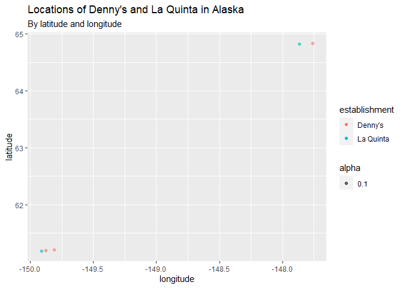<!-- -->

### Exercise 4

Let’s plot the locations for both establishments in the NC and TX. We
can see that not every La Quinta has a Denny’s nearby in NC. However, it
seems to hold for TX.

``` r
dn <- dn %>%
  mutate(establishment = "Denny's")
lq <- lq %>%
  mutate(establishment = "La Quinta")
dn_lq <- bind_rows(dn, lq)
dn_lq %>%
  filter(state == "NC") %>%
  ggplot(data, mapping = aes(x = longitude, y = latitude, color = establishment, alpha = 0.5)) +
  geom_point() +
  labs(title = "Locations of Denny's and La Quinta in NC", subtitle = " By latitude and longitude")
```

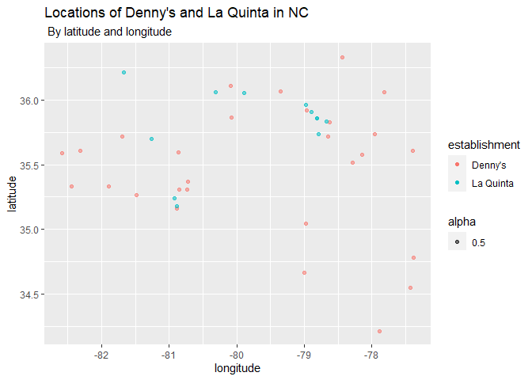<!-- -->

``` r
dn_lq %>%
  filter(state == "TX") %>%
  ggplot(data, mapping = aes(x = longitude, y = latitude, color = establishment, alpha = 0.1)) +
  geom_point() +
  labs(title = "Locations of Denny's and La Quinta in TX", subtitle = "By latitude and longitude")
```

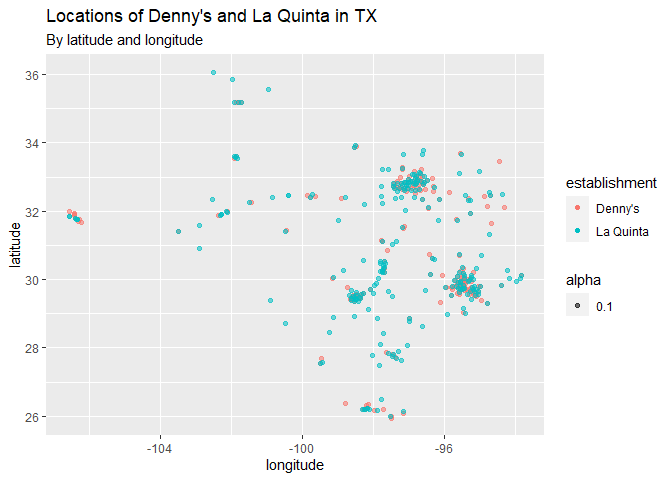<!-- -->

### Exercise 5

It seems to hold for most southern states! The degree of overlap is high
in the maps below.

``` r
dn_lq %>%
  filter(state == "CA") %>%
  ggplot(data, mapping = aes(x = longitude, y = latitude, color = establishment, alpha = 0.1)) +
  geom_point() +
  labs(title = "Locations of Denny's and La Quinta in CA", subtitle = "By latitude and longitude")
```

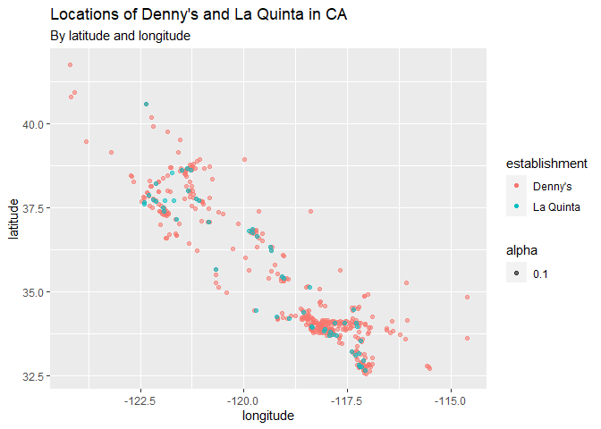<!-- -->

``` r
dn_lq %>%
  filter(state == "FL") %>%
  ggplot(data, mapping = aes(x = longitude, y = latitude, color = establishment, alpha = 0.1)) +
  geom_point() +
  labs(title = "Locations of Denny's and La Quinta in FL", subtitle = "By latitude and longitude")
```

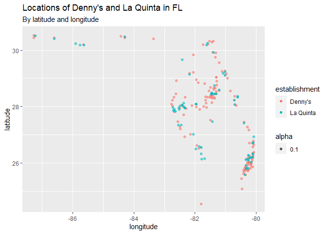<!-- -->

``` r
dn_lq %>%
  filter(state == "GA") %>%
  ggplot(data, mapping = aes(x = longitude, y = latitude, color = establishment, alpha = 0.1)) +
  geom_point() +
  labs(title = "Locations of Denny's and La Quinta in GA", subtitle = "By latitude and longitude")
```

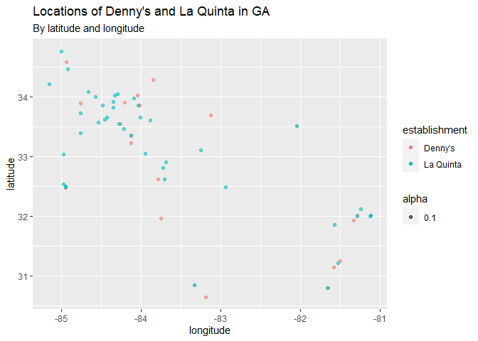<!-- -->

``` r
dn_lq %>%
  filter(state == "AZ") %>%
  ggplot(data, mapping = aes(x = longitude, y = latitude, color = establishment, alpha = 0.1)) +
  geom_point() +
  labs(title = "Locations of Denny's and La Quinta in AZ", subtitle = "By latitude and longitude")
```

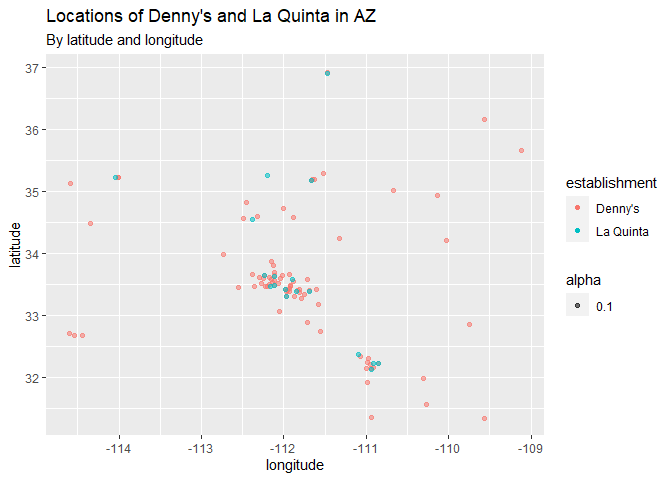<!-- -->

``` r
dn_lq %>%
  filter(state == "NM") %>%
  ggplot(data, mapping = aes(x = longitude, y = latitude, color = establishment, alpha = 0.1)) +
  geom_point() +
  labs(title = "Locations of Denny's and La Quinta in NM", subtitle = "By latitude and longitude")
```

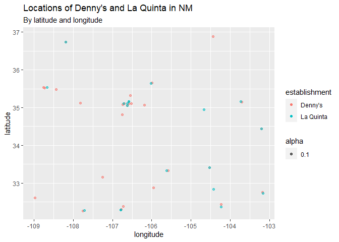<!-- -->

``` r
dn_lq %>%
  filter(state == "AL") %>%
  ggplot(data, mapping = aes(x = longitude, y = latitude, color = establishment, alpha = 0.5)) +
  geom_point() +
  labs(title = "Locations of Denny's and La Quinta in AL", subtitle = " By latitude and longitude")
```

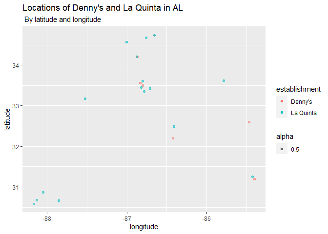<!-- -->

``` r
dn_lq %>%
  filter(state == "LA") %>%
  ggplot(data, mapping = aes(x = longitude, y = latitude, color = establishment, alpha = 0.5)) +
  geom_point() +
  labs(title = "Locations of Denny's and La Quinta in LA", subtitle = " By latitude and longitude")
```

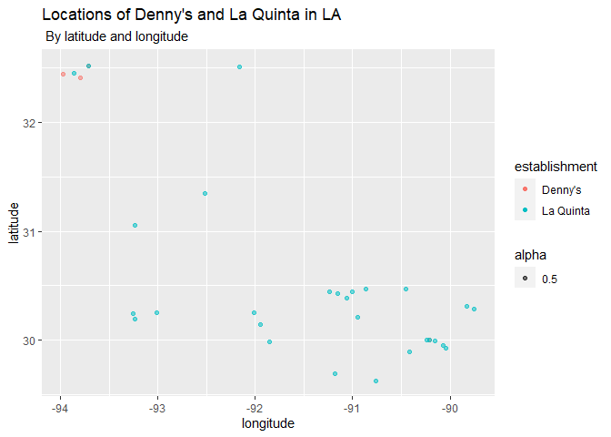<!-- -->

``` r
dn_lq %>%
  filter(state == "MS") %>%
  ggplot(data, mapping = aes(x = longitude, y = latitude, color = establishment, alpha = 0.5)) +
  geom_point() +
  labs(title = "Locations of Denny's and La Quinta in MS", subtitle = " By latitude and longitude")
```

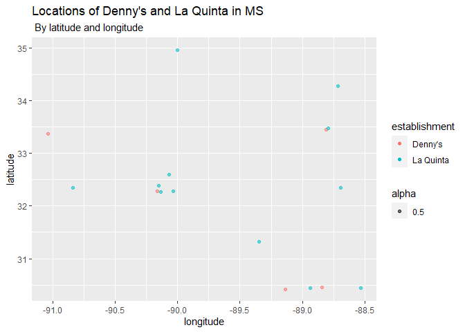<!-- -->
